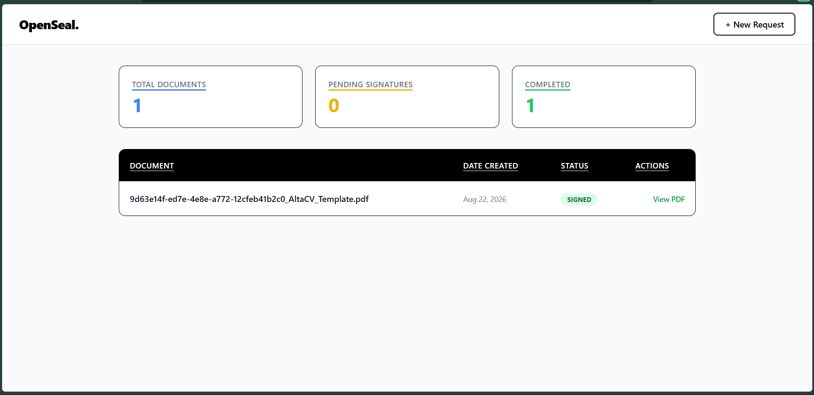
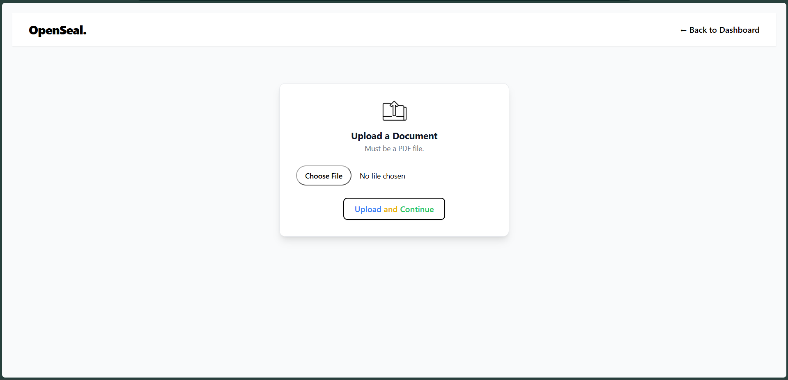
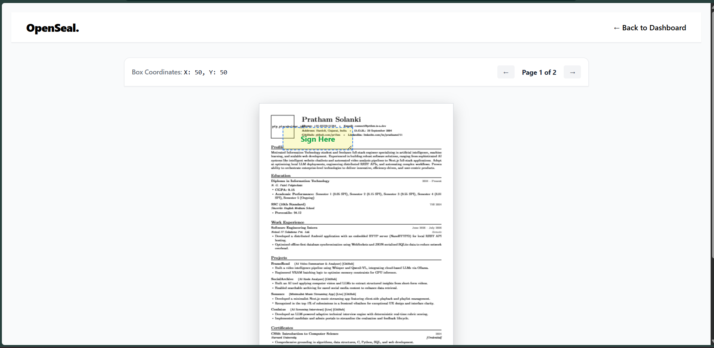
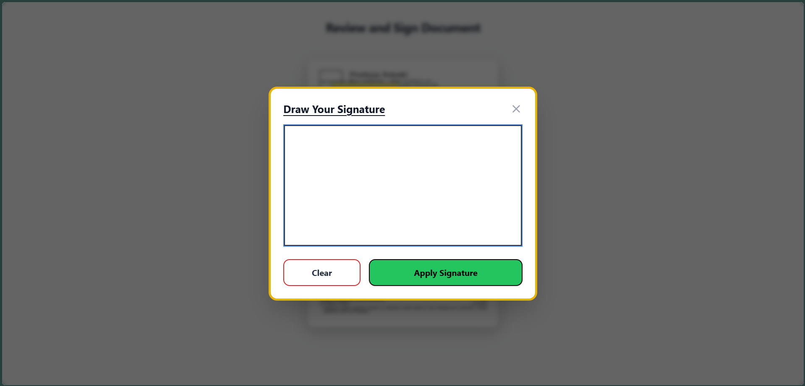

# OpenSeal
### Sign Documents Online

Sign Documents online with OpenSeal. It's made completely on FastAPI (Python) and Vanilla HTML. Which makes it easier to tweak by yourself ;) Consider it as an Open-Sourced alternative to DocuSign.

## Demo
Here's the complete screen recording of the whole flow from uploading to signing:

<video controls width="100%">
  <source src="./static/openseal-demo.mp4" type="video/mp4">
  Sorry, your browser doesn't support embedded videos.
</video>

<p align="center">
  
  
  
  
</p>

## Test it yourself..

#### Create a virtual environment: 
```bash
python -m venv .venv
```

#### Activate the env: 
(Windows) 
```bash
.\.venv\Scripts\activate
```
OR 
(Mac/Linux)
```bash
source .venv/bin/activate
``` 

#### Install dependencies: 
```bash
pip install -r requirements.txt
```

- #### Run the server: 
```bash
python main.py
```
OR
`uvicorn main:app --host 0.0.0.0 --port 8000` (for production)

Visit to `http://localhost:8000/` to view the working app (prototype for now ;)

## How that actually works?
1. **The Dashboard**: on the standard `/` page is a dashboard or, your command center. 
2. **/new-request**: on this page, you're first asked to upload the PDF. After that it renders the PDF and allows you to place that little box (Sign box) anywhere over the PDF document. You hit save and it generates (actually copies the URL to your clipboard. So, you don't have to.)
2. **Sign it**: On `/sign` URL followed by your `{docID}` (e.g: `http/s://<localhost/domain>/sign/2bb36f25-c50d-4c59-be08-d926c3ef7fbc`) . You / Signer can sign in the box by clicking on it. draw the signature on the canvas and save. Voila..
3. **View the update**: In the dashboard (the `/`). It will say signed in the status instead of pending.

Congratulations. You just can now sign your most important document signed online.

## A little note:

I know there are many things that need to update. But let's be real. Do you real care about the colors or the UX when you wanna sign your critical document within the deadline?

But I know what I've done. And a little disclaimer that admin sided pages (like `/` or `/new-request`), aren't optimized for mobile view. 

But the signer can absolutely sign the document in mobile..
